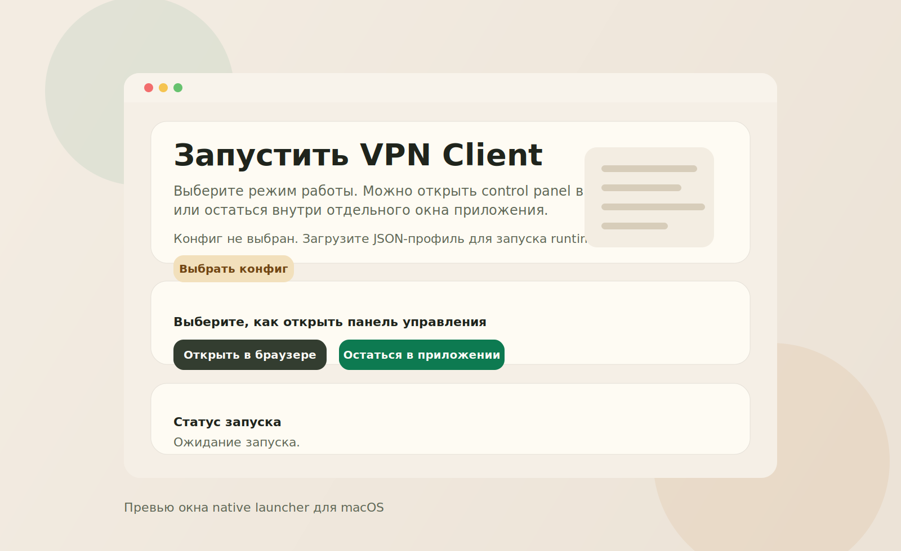
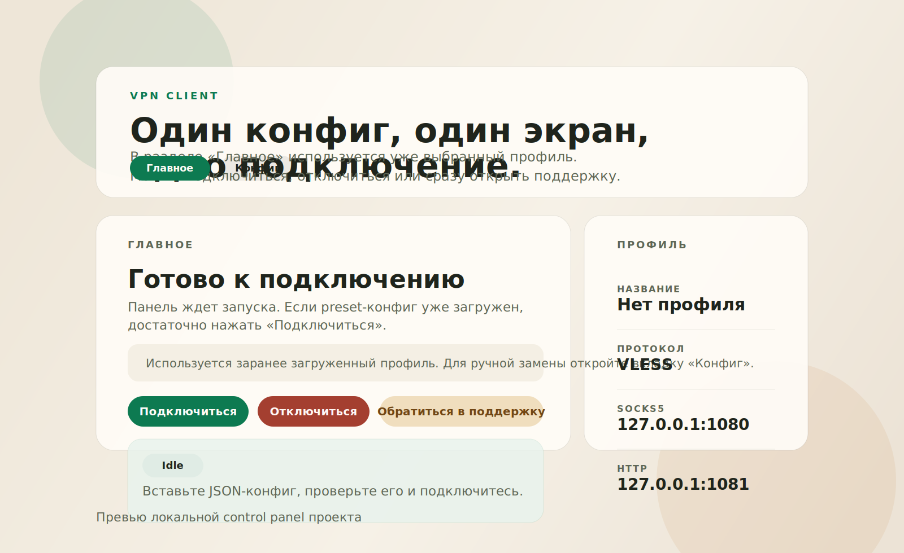

# PeshkiM VPN Client

PeshkiM VPN Client — это desktop-приложение для macOS с локальной панелью управления VPN-подключением. Проект запускает runtime-протоколы, открывает control panel во встроенном окне или в браузере и умеет собираться в `.app` и `.dmg`.

## Скриншоты интерфейса

Проект содержит пользовательский интерфейс:

- native launcher для macOS
- встроенную control panel на базе локального HTTP-сервера и WebView

Ниже добавлены актуальные изображения интерфейса из каталога `docs/screenshots/`.

### Native launcher для macOS



### Control panel



## Технологический стек

- Go 1.26
- Objective-C++ / AppKit / WebKit
- Bash-скрипты для сборки macOS-приложения и DMG
- Xray как основной bundled runtime
- Hysteria как дополнительный runtime при наличии бинарника

## Как клонировать репозиторий

```bash
git clone https://github.com/y0rence/Peshki_M.git
cd Peshki_M
```

## Как установить зависимости

Для локальной сборки нужны:

1. macOS 13+
2. Go 1.26+
3. Xcode Command Line Tools
4. Homebrew
5. Xray

Установка основных зависимостей:

```bash
xcode-select --install
brew install xray
```

Если нужен bundled `hysteria`, положите совместимый бинарник в корень проекта под именем `hysteria-darwin-arm64` или передайте путь через переменную `HYSTERIA_BINARY`.

## Инструкция по запуску

Быстрый запуск локальной проверки:

```bash
go test ./...
./scripts/build_macos_app.sh
open build/VPNClient.app
```

Сборка DMG:

```bash
./scripts/build_macos_dmg.sh
```

Сборка второй версии DMG:

```bash
APP_VERSION=2.0.0 APP_BUILD=2 DMG_SUFFIX=second-version ./scripts/build_macos_dmg.sh
```

## Как запустить проект локально

Локальный запуск backend-панели:

```bash
go run ./cmd/vpnclient-ui -config ./configs/PeshkiM.json
```

Локальная проверка CLI-клиента:

```bash
go run ./cmd/vpnclient -config ./configs/PeshkiM.json -command validate
```

## Дополнительная документация

Расширенная документация по проекту находится в файле:

- `docs/TRPO_project_documentation.docx`

## Статус проекта

Статус: в разработке.

Сейчас проект уже умеет:

- собирать macOS-приложение в `.app`
- собирать установочный `.dmg`
- запускать bundled `xray` изнутри приложения
- открывать локальную панель управления VPN

В ближайших доработках:

- при необходимости упаковать bundled `hysteria` для macOS
